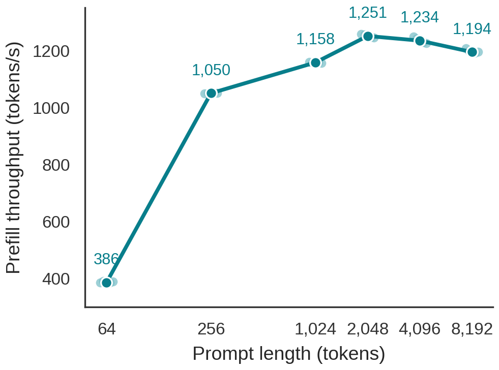
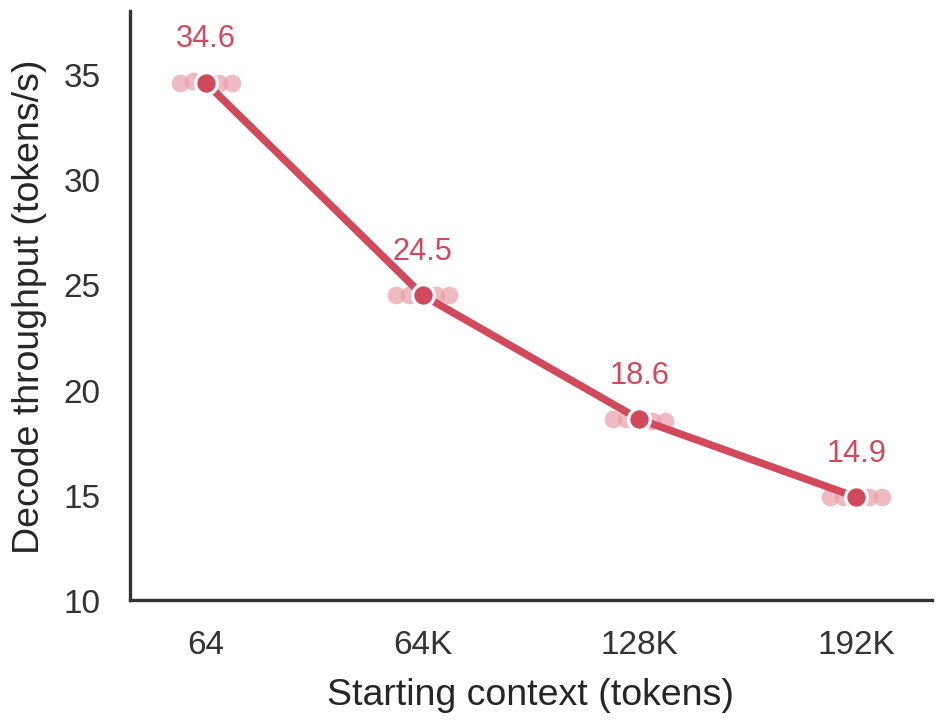

# Qwen3.8-27B full-optimization AR matrix on W7900

This run measures the Qwen3.8-27B MQ4 trunk with pure autoregressive decode on
GPU1 (Radeon Pro W7900 Dual Slot, gfx1100). DFlash, MTP, DSpark, and n-gram
speculation were disabled. The staged Asym3-K/Q8-V CK sidecar and all validated
gfx11 packed-MQ4 production routes were enabled.

## Method

- Model: `~/.hipfire/models/qwen3.8-27b.mq4`
- Model SHA-256: `d220334acc374548ad8582ba24d4ca5f7d94622d6f8c10268be75e5ee0aee4f6`
- Source commit: `f35877f18666308b9c8208bdc34b721c8812b597`
- KV: contiguous Asym3 K plus Q8 V
- Prefill chunk limit: 2048 tokens
- Five reported samples per point; one additional prefill warmup was excluded
- Final short-prefill sweep started at 58 C junction / 55 C memory with 30 s
  cooling between points
- Capacity and decode sweeps used 10 s cooling and intentionally represent a
  sustained long-running workload
- Decode produced exactly 4096 tokens after 8 unreported warmup tokens; no EOS
  or answer-length termination was used

`prefill.tsv` and `decode.tsv` contain the raw values. The `logs/` directory
contains one complete process log per prefill/capacity point and per decode
trial; each prefill/capacity log records its warmup plus five reported runs.

## Figures

- `figures/qwen38_prefill_scaling.pdf` and `.png`
- `figures/qwen38_decode_scaling.pdf` and `.png`





Regenerate both figures from the raw TSV files with:

```bash
MPLCONFIGDIR=/tmp/matplotlib-qwen38 \
python experiments/qwen38-fullopt-ar/plot_results.py
```

The plotting script requests Arial and automatically uses the metrically
compatible Liberation Sans fallback when Arial is unavailable. The archived
PDFs embed Liberation Sans because Arial is not installed on this host.

## Prefill length sweep

| Prompt tokens | Median tok/s | Five samples (tok/s) |
|---:|---:|---|
| 64 | 386.3 | 386.3, 390.8, 384.4, 386.3, 390.1 |
| 256 | 1050.0 | 1049.0, 1050.9, 1046.8, 1050.3, 1050.0 |
| 1024 | 1157.7 | 1159.7, 1158.5, 1157.0, 1157.7, 1155.4 |
| 2048 | **1250.7** | 1257.0, 1255.4, 1250.7, 1247.5, 1244.6 |
| 4096 | 1234.4 | 1248.4, 1242.1, 1234.4, 1229.8, 1225.4 |
| 8192 | 1194.3 | 1208.3, 1199.2, 1193.2, 1191.8, 1194.3 |

PP2048 is the measured sweet spot. PP4096 is 1.3% slower and PP8192 is 4.5%
slower. PP64 is dominated by fixed per-forward costs.

Route markers show that PP64 remained on the native short path, PP256 used the
staged CK path, PP1024/2048 used the direct quantized CK entry, and
PP4096/8192 used staged CK over 2048-token chunks. No route failure or fallback
was recorded.

## PP2048 with larger allocated KV capacity

These points still process only 2048 prompt tokens. `kv_seq` changes the
allocated cache capacity, not the amount of history read by attention.

| Allocated KV capacity | Median tok/s | Five samples (tok/s) |
|---:|---:|---|
| 65,536 | 1275.2 | 1280.8, 1279.5, 1275.2, 1271.1, 1268.3 |
| 131,072 | 1249.4 | 1255.2, 1253.7, 1249.4, 1246.5, 1243.2 |
| 196,608 | 1239.0 | 1244.4, 1240.4, 1239.0, 1237.1, 1233.8 |

The 192K allocation is 2.8% below the 64K allocation. The 64K point being
slightly faster than the auto-sized PP2048 run is not evidence that larger KV
capacity improves execution; capacity changes allocation size, layer spacing,
and device addresses. The defensible result is that the observed capacity tax
from 64K to 192K is small but non-zero.

## Long AR decode

| Starting context | Median tok/s | Median p50 ms/token | Five throughput samples |
|---:|---:|---:|---|
| 64 | **34.6** | 28.63 | 34.6, 34.7, 34.6, 34.6, 34.6 |
| 65,536 | **24.5** | 40.59 | 24.5, 24.5, 24.5, 24.5, 24.5 |
| 131,072 | **18.6** | 53.62 | 18.6, 18.6, 18.6, 18.5, 18.5 |
| 196,608 | **14.9** | 67.00 | 14.9, 14.9, 14.9, 14.9, 14.9 |

The p50 token cost grows almost linearly, by approximately 12.8 ms for each
additional 64K context over this range. Relative to the near-zero-context
run, throughput is 29.2% lower at 64K, 46.2% lower at 128K, and 56.9% lower at
192K. This is an actual-history effect and is distinct from the fixed-PP2048
capacity experiment above.

The full prefill that positioned each decode run also remained stable across
five processes: 897.9 tok/s median at 64K, 685.8 tok/s at 128K, and 558.5
tok/s at 192K. Those values include the increasing causal-attention work over
the full history and must not be compared directly to the fixed PP2048 rows.

## Result boundary

These are single-GPU, pure-AR, synthetic-token kernel/runtime measurements on
one W7900 Dual Slot. They establish Qwen3.8 throughput and context scaling for
this exact binary, model, KV layout, and sidecar. They are not DFlash/MTP
results and do not claim the same numbers for RX 7900 XTX, gfx12, another
quantization, or an OpenAI serving workload with network and scheduler costs.
